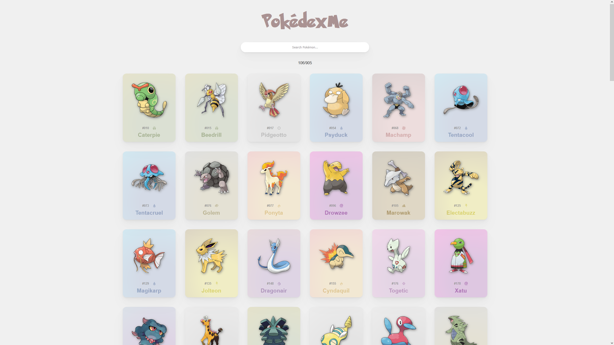

# Pokédex Online

A simple pokédex connected to a database.
---

#### Live Demo:

You can test the it on [THIS SITE](https://ed0.it/pokedex)!



---

#### Features:

- Cards colored according to the type of the pokémon

- Search bar (number and name)

- The site is responsive

- Redirect to Pokémon information on the official Nintendo site

- It is not necessary to host photos of Pokémon, use photos from the official Nintendo site

###### Note:

The json of the updated pokédex can be found in this other repo of mine, together with the extractor:

- [Pokédex JSON](https://github.com/Ed0ardo/PokedexJSON)

I also uploaded an old version of the site, aesthetically simpler and therefore more easily reusable for other projects:

- [LIVE DEMO - OLD](https://ed0.it/pokedex/old)
- [Old Code](old)

This site is connected to a Telegram bot that allows you to collect Pokémon, if you want to take a look at it:

- [PokédexMeBot](https://t.me/PokedexMeBot/)

---

#### Prerequisites:

- PHP
- A site (obviously)
- A database (I use MySQL)

---

#### Installation:

1. Create a database with a table called *"pokeball"* with this schema:
   
   | id       | pokemon   |
   | -------- | --------- |
   | bigint() | varchar() |
   
   ```sql
   CREATE TABLE `pokeball` (
     `id` bigint(19) DEFAULT NULL,
     `pokemon` varchar(5) DEFAULT NULL
   );
   ```

2. Edit **index.php** with the database login credentials you just created

3. That's all folks!

---

#### Donation:

> ***Buy me a coffee*** *(PayPal)*:    [Ed0ardo](https:///paypal.me/ed0ardo)

> ***Buy me a coffee*** *(Binance Pay)*:    268880867

> ***Buy me a coffee*** *(Ko-Fi)*:    [Ed0ardo](https:///ko-fi.com/ed0ardo)

> ***Buy me a coffee*** *(Trust Wallet)*:    0x825fFeB482BE713eA3bFea0F3B8c398813B65269

> ***Buy me a coffee*** *(CashApp)*:    $Ed0ardo
